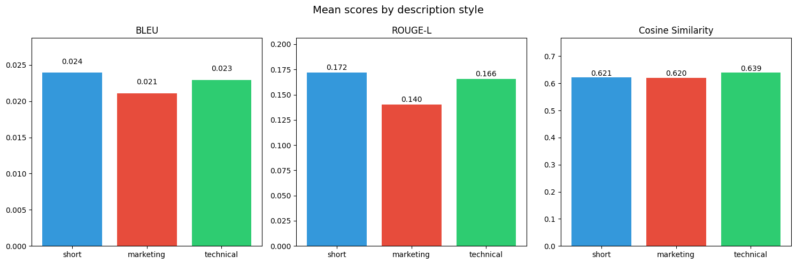
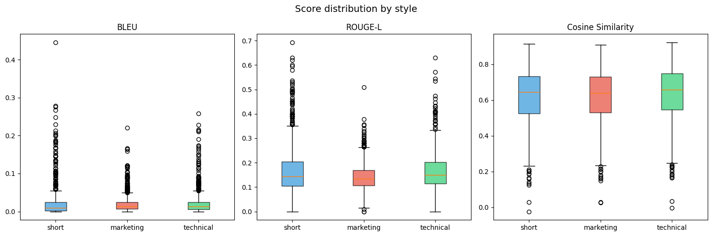
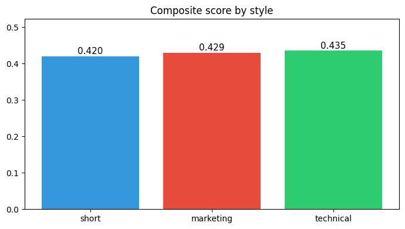
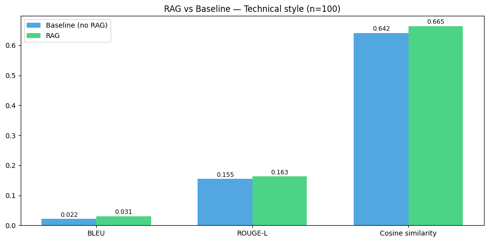
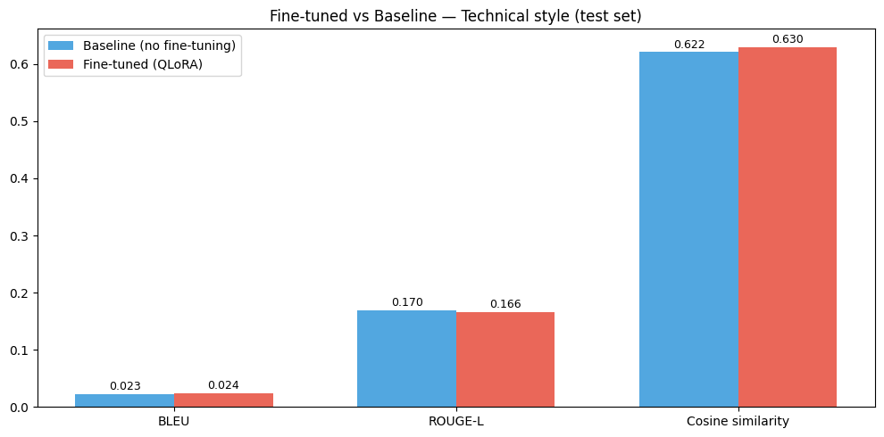
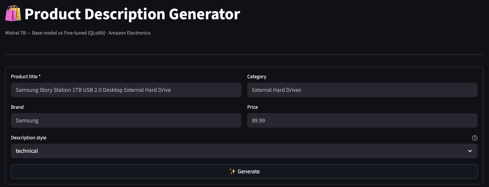
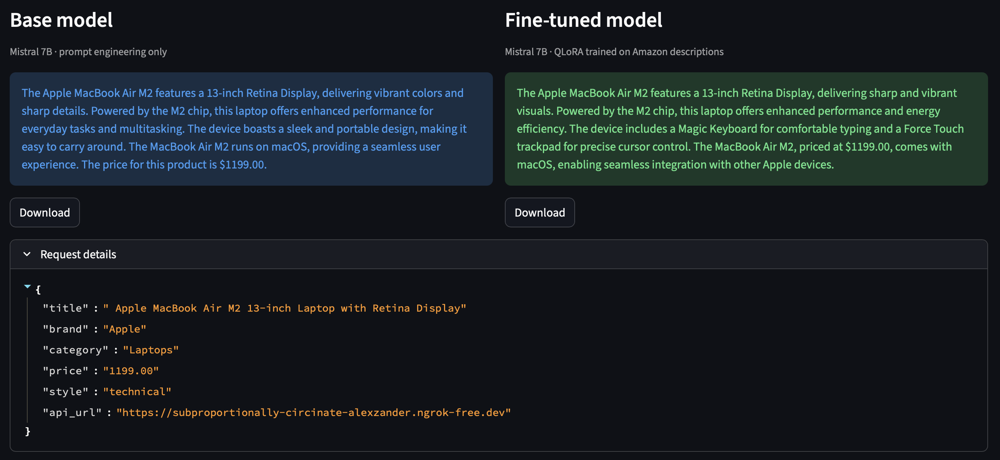

# Generate Product Descriptions with Fine-Tuned LLMs

## Business Problem

E‑commerce catalogs grow quickly, but high‑quality product descriptions remain expensive and time‑consuming to write manually.

How can we automate the generation of accurate, engaging, and scalable product descriptions using Large Language Models — and answer a simple question:  
does fine‑tuning actually improve over prompt engineering alone?

## Proposed Solution

This repository builds a full end‑to‑end pipeline to generate product descriptions from structured product metadata (`title`, `brand`, `category`, `price`) and compare:

- a base LLM using prompt engineering,
- a RAG‑enhanced variant (FAISS retrieval + context injection),
- a fine‑tuned variant using QLoRA (PEFT) on Mistral‑7B.

The workflow is organized as 6 notebooks (data preparation → prompt generation → evaluation → RAG → fine‑tuning → deployment), plus a Streamlit UI for exploration.

## Results

| Approach | Composite Score | vs. Baseline |
|----------|----------------|--------------|
| Base (prompt engineering) | — | — |
| + RAG (FAISS retrieval) | ↑ +3.2% | retrieval context injection |
| + LoRA fine-tuning (QLoRA) | ↑ +1.4% | domain adaptation |

Best style: **`technical`** — composite score ~0.435 (BLEU + ROUGE-L + cosine similarity).

## Pipeline Overview

```
Raw data → Cleaning → Prompt Engineering → Base LLM
                              ↓
                    Fine-Tuning (QLoRA)
                              ↓
              Evaluation (BLEU / ROUGE-L / Cosine)
                              ↓
          (Optional) RAG: retrieval + context injection
                              ↓
              FastAPI API → Streamlit Application
```

## Notebooks

| Notebook | Description |
|----------|-------------|
| `01_Load_&_Clean.ipynb` | Load Amazon Electronics dataset, filter, and deduplicate → `clean_products_800.csv` |
| `02_Prompt_Engineering.ipynb` | Multi‑style prompt templates: `short` / `marketing` / `technical` |
| `03_Evaluation.ipynb` | BLEU, ROUGE‑L, cosine similarity, composite score → `scores_evaluation.csv` |
| `04_RAG.ipynb` | FAISS index, top‑k retrieval, context injection → `rag_results.jsonl` |
| `05_LoRA.ipynb` | QLoRA fine‑tuning on Mistral‑7B Instruct (targets: q/k/v/o/gate/up/down proj) |
| `06_API.ipynb` | FastAPI endpoints (`/generate`, `/health`) + ngrok public URL |

## Technologies

- Python
- Hugging Face Transformers
- PEFT (QLoRA)
- Mistral‑7B Instruct
- FAISS
- sentence‑transformers
- FastAPI
- Streamlit
- Pandas
- NumPy

## Business Impact

This pipeline offers a scalable way to:
- Scale content creation across large catalogs (hours → seconds).
- Ensure consistent tone and quality via domain adaptation.
- Control output style (`short` / `marketing` / `technical`).
- Maintain a reproducible evaluation loop using BLEU, ROUGE‑L, and cosine similarity.

## Evaluation Plots

- 
- 
- 
- 
- 

## Streamlit Application

  


<p align="left">
  
</p>

Run locally:

```bash
python3 -m streamlit run app/app.py
```

> The Streamlit app calls a FastAPI backend via `API_URL` (configured for a ngrok URL in `app/app.py`).

## Repository Structure

```
├── notebooks/   # 01 to 06 — full pipeline
├── app/         # Streamlit UI
├── data/        # processed dataset + evaluation outputs
├── models/      # PEFT adapter + configs
└── assets/      # screenshots and plots
```

## How to Reproduce

1. `01_Load_&_Clean.ipynb`
2. `02_Prompt_Engineering.ipynb`
3. `03_Evaluation.ipynb`
4. *(Optional)* `04_RAG.ipynb`
5. `05_LoRA.ipynb` — save adapter to `models/final_adapter/`
6. `06_API.ipynb` — start FastAPI, get backend URL
7. Update `API_URL` in `app/app.py` and run Streamlit
